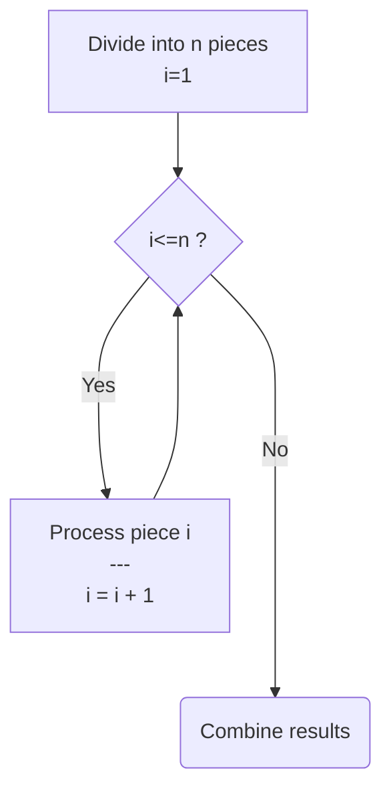
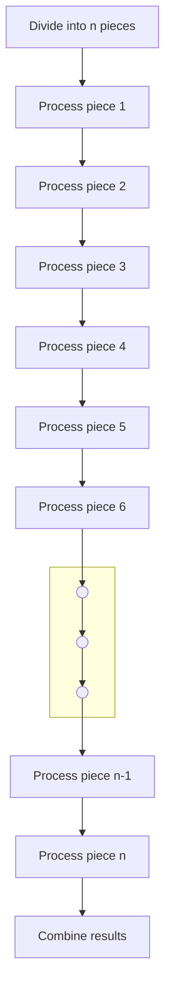
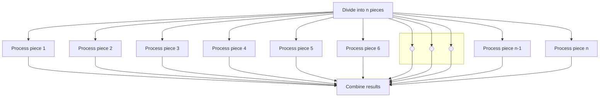
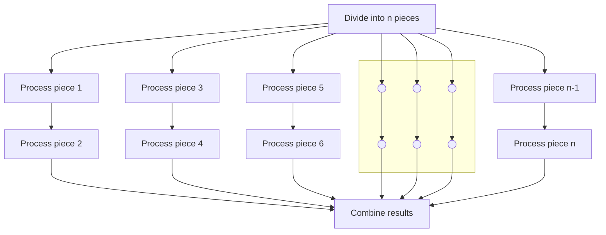

# FEderated DISTribution
A federated approach to process and data distribution

When a problem overwhelms us we [divide and conquer](https://en.wikipedia.org/wiki/Divide-and-conquer_algorithm) it's complexities to express the solution as work for a computer. When the volume of work we palm off to a computer overwhelms it's capacity we employ a simmilar set of tools to spread the workload over a processor's multiple cores ([concurrency](https://en.wikipedia.org/wiki/Parallel_computing)) or several networked computers ([distribution](https://en.wikipedia.org/wiki/Distributed_computing)).

## Figure 1: Pseudo Algorithm

## Figure 2: Single Tasking

## Figure 3: Multitasking (Ideal)

## Figure 4: Multitasking (Constrained)
