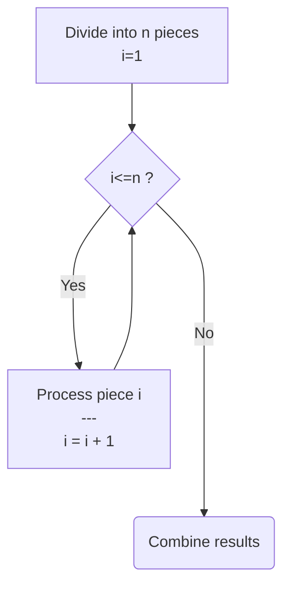
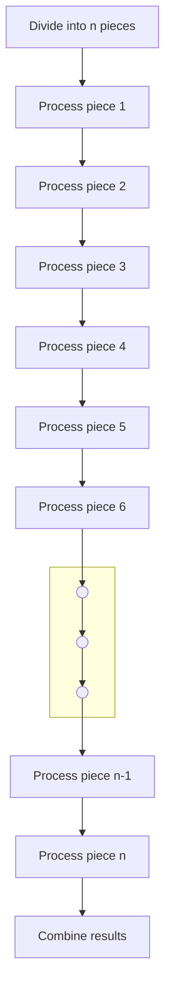
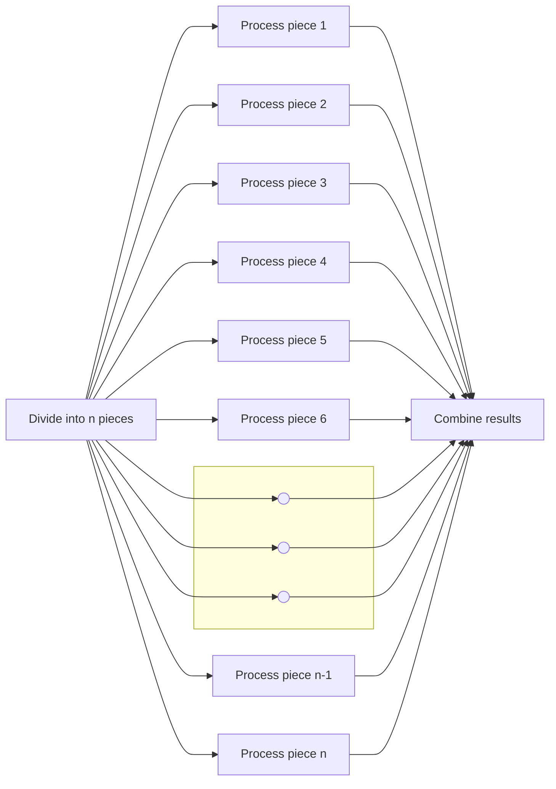
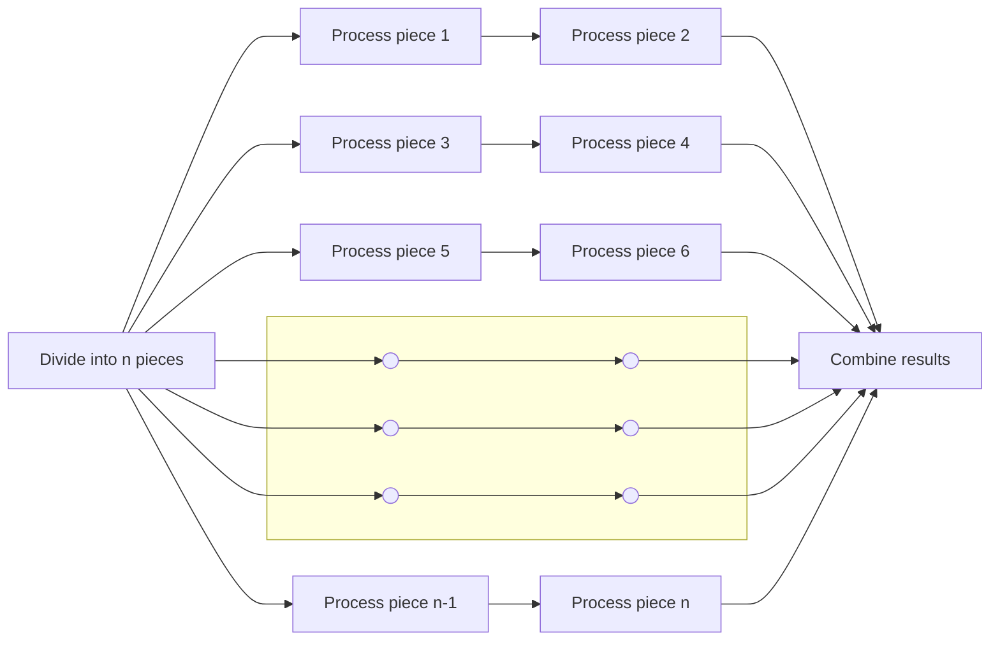

# FEderated process and data DISTribution
A federated approach to process and data distribution

## Abstract
When a problem overwhelms us we [divide and conquer](https://en.wikipedia.org/wiki/Divide-and-conquer_algorithm) its complexities to express the solution as work for a computer. When a computer's workload overwhelms its capacity we employ a similar set of tools to spread the load across multiple processes running [concurrently](https://en.wikipedia.org/wiki/Parallel_computing) on multi-core hardware and/or [distributed](https://en.wikipedia.org/wiki/Distributed_computing) over several connected computers which the existing facilities in both [Distributed Erlang/OTP](https://www.erlang.org/doc/system/distributed.html) and [Distributed Elixir](https://hexdocs.pm/elixir/distributed-tasks.html) assume to be connected via a fast private (local) network. Connecting nodes or clusters over public networks and/or high latency links renders the built-in facilities ineffective. 

The FeDist library for Elixir implements a specialised form of process- and data-distribution dubbed Federated Distribution which overcomes LAN dependency, increases tolerance for high network latency and outages and provide the means to spread the workload so that inter-node network traffic is minimised.

## Federated Distribution

To describe how Federated Distribution differs from its more complex general purpose relatives a quick review how process and data distribution works is in order to highlight the key differences.

### Abstract Solution
As a starting point, let's assume we've divided and conquered our way through the complexities of a problem to the point where we have a set, array or list of pieces that needs to be processed in a specific way to get the result we need. In a pseudo flow-diagram it might look something like this (Figure 1):

#### Figure 1: Pseudo Algorithm

### Naive Execution (Single Process)
Supposing we implement that pseudo solution as a single process we can expect that the loop in Figure 1 would expand to something resembling Figure 2 below:

#### Figure 2: Single Tasking

### Ideal Parallel Execution
Alternatively we can arrange to use a separate process to do the processing for each piece. Provided we have sufficient cores and use well-written processes we can ideally expect the work getting done as depicted as below in Figure 3:

#### Figure 3: Multitasking (Ideal)
### Realistic Parallel Execution
In reality, especially when there's way more pieces than cores or threads, the processing of the pieces ends up being spread more or less evenly across the computers, cores and threads (and even processes when we realise that even Erlang/Elixir have limitations as to how many processes it can run). The result, however we choose to allocate pieces to processes might look something like what's depicted here in Figure 4:

#### Figure 4: Multitasking (Constrained)

| Name  | Aproach |  Issues |
| ------------- | ------------- | -- |
| Sequential  | Queue up whole tasks and get each of them done.  | Practical limitations on processor speeds.  Single location and host only |
| Concurrent  | Queue up parts of tasks so all progress at the same time but smaller tasks get done sooner than bigger tasks. | Also limited by processor speeds but with added overhead from context switching in exchange for more equitable throughput of multiple tasks.  Single location and host only |
| Parallel:SMP  | Divide the tasks between several processors on a single bus sharing the same memory | Non-linear scaling. Single location and host only. |
| Parallel:MPP  | Divide the workload between several processors that can communicate but otherwise share nothing | Require hard to design specialised software with no feeder market. Single location and host only. |
| Distributed  | Divide the workload between a cluster of computers connected via LAN | Require hard to design specialised software. Single location only. |
| Federated  | Divide the workload between several clusters which interact over a network but otherwise share nothing | Require software similar to MPP complexity which can be avoided in some cases. Limited feeder market. Tools in early stages of development. |

### Table 1: Ways to handle big workloads

## Distribution Delineation
Delineation is a key concept where in most of the approaches listed in Table 1 above we can more or less assume that spreading the workload equally across the available resources would be the objective. Federated Distribution is the exception. In a Federated schema we start with an  already distributed problem with the objective being to match the way the problem (and its data and processing demands) are already distributed in how the application and the resources available to it is distributed in response. 

If we say delineation is the manner in which the pieces are assigned to processors we'd call the piece's attribute which determines that allocation distribution delineator, e.g. the index or position of the piece in an array or list in the examples above would be its delineator.

### Simple Delineation
Building a distributed system is hard enough already so keeping it as easy as possible by making simplifying assumptions and decisions is common practice. This usually results in the computers being clustered all being equally powerful and having access to the same data making delineation a trivial matter resolved by using randomisation or round-robin allocation.

### Advanced Delineation
So far we've silently assumed simple delineation, i.e. that each process or processor gets the same amount of work to do. We've also assumed that from the processes' perspectives which pieces they're assigned to process is immaterial. Those assumptions are relatively safe to make on a single computer and even on a LAN connected cluster. If however our problem already breaks the assumptions of simple delineation before we've started solving it, we'd be forced to consider [smarter](https://en.wikipedia.org/wiki/SMART_criteria) ways to allocate work to processors.

Of the endless possibilities, let's consider these two:

#### Allocation based on capacity
Assuming our objectives include for all the work to complete as early as possible, but not all the processes run at the same pace (and/or not all the pieces require the same amount of work) we'd need to allocate pieces to processes based on the speed of the process(or) and the size of the jobs we give it. 

#### Allocation based on privilege
Assuming our objectives include minimising resource usage, but processing a piece on a specific (set of)processor(s) uses significantly less resources compared to others we'd need to allocate pieces to processors where it would use the least resources.

### Delineation in FeDist
Normally we'd expect that more advanced delineation would increase the complexity of a distributed system exponentially. However, when there is some clearly identified dominant delineator already front and centre in the problem before we've even writing software to solve it, the inverse is true. To use simple delineation in those scenario complicates matters and isolating the delineator as a separate concern which slots into a support library that allows for process and data distribution based governed by that domain specific delineator actually makes writing such systems a great deal simpler, perhaps even trivial.

## Other Libraries

Why a new library when there's already several in what seems to be the same space ranging from several service mesh implementations such as [Linkerd](https://linkerd.io), [Istio](https://istio.io) and even Elixir-specific adaptations such as [Meshx](https://hexdocs.pm/meshx/readme.html)? Then there's [Partisan](https://github.com/lasp-lang/partisan) and [ProcessHub](https://github.com/alfetahe/process-hub). Someone even suggested that [Riak's Core](https://github.com/basho/riak_core) could help.

The decision to create a new library only came after all attempts to find alignment between the actual problem space and the concepts used in or established by the candidate libraries had revealed the harsh truth that firstly all the libraries tended to increase the overall complexity, secondly no one library solved the entire problem and thirdly using a combination of libraries compounded the additional complexity by making the overlaps in functionality and clashing concepts issues to deal with in the application code. 

## Yacawad - Federated Distribution By Example

Yacawad is **Y**et **a**nother **c**hat **a**pp (but) **w**ith **a**lternative **d**istribution.

The application you end up with after following a tutorial such as [Sophie DeBenedetto's](https://fly.io/phoenix-files/building-a-chat-app-with-liveview-streams/) showcases the suitability of Elixir/Phoenix with LiveView/Streams for writing such responsive user-centric applications with minimal effort. The app you end up with though is nowhere near suitable as even a starting point for an actual chat application simply because it wasn't designed to be scaled and rolled out globally, i.e. it lacks FeDist. Yacawad is the exact same example but with federated distribution (FeDist style) incorporated into the design and code. The example application still stops way short of being commercially viable code, that's still up to whoever wants to throw their hat in that ring, but it does address one of the trickier challenges faced by any application faced with an inherently distributed workload problem in a manner where those of us working on the solution can benefit from each other's efforts. 

If the users we wrote Yacawad for were all near enough to a single city or datacenter to provide a good user experience from a cluster of load-balanced nodes in that datacenter that would have been sufficient and simple to arrange. The workload generated by a single user is small enough to facilitate hundreds to thousands of concurrent users on a node. The usual tutorials would make the simplifying assumption that the provision for a globally distributed audience is best left to suitably experienced professionals and the well-funded projects that can affort to hire them.

But let's unpack some of the challenges a chat app would face if it actually tackled a global audience just enough to highlight what could be a simple solution to complex and scary problem.

Phoenix, LiveView, Streams with the PubSub model renders the code and processing involved in accepting a message being typed in a chatroom and displaying it on the screens of everyone else currently in that chatroom to near trivial proportions. Raw complexity and size of a single task is no longer the problem to be solved. The remaining problems are:- 

1. user and message volumes, and 
2. the actual geographic distribution of users. 

We can hope to solve raw volumes by clustering several computers behind a load-balancer but that'll mean that (remote) users will get a much worse experience than those lucky enough to live close to whereever that cluster is hosted. Content Distribution Networks (CDNs) do not work effectively for dynamic content such as LiveView and messaging as they were designed for predominantly static content such as regular websites.

Yacawad would be neither the first nor the last to encounter these problems. Among the most common way engineers deal with the mismatch between how there application is distributed versus how its users are distributed are to:-
1. postpone dealing with it until the application generates sufficient revenue to warrant a complete redesign incorporating all the complexities of (remotely) distributed data storage and processing,
2. hire distributed infrastructure from public cloud providers to deploy on, 
3. manage user expectations so remote users would accept poor performance, or
4. contain their target audience to a single geographic area.

Note, it's easy enough to argue that since chat is essentially an asynchronous communication tool fast response times aren't that critical and can be achieved in more traditional ways. That may or many not be the case, but it's hardly the point. Chat in this context is used as minimal example of a LiveView application with users spread far and wide where the impact of high latency connections to the servers on user experience is exaggerated somewhat artificually to illustrate how the FeDist library renders it so simple to design an application which aligns itself to whatever remote, non-uniform distribution of the problem occurs naturally in the problem itself that it even makes sense to do that for a chat application. 

\[Yacawad Tutorial/Repository Reference\]
> My plan is to negotiate with Sophie DeBenedetto that we either rework her tutorial as example FeDist-based application or set up such an example application as a repository for others to fork as point of departure. Especially in the light of the impending release of LiveView 1.0 it would be ideal to keep the example perfectly aligned with that, which is ground she and Bruce Tate would need to cover to finalise their book on LiveView Programming anyway. 

\[/Tutorial/Repository Reference\]

## Separation of Concerns

It's relatively straight forward to design the database of an application to allow for regions spread across the world with individual users assigned one way or another to a home region. The challenge we face is that the code to use that (regional) structure as basis for distributing the data and processing can get a bit tricky especially if ever time anyone needs it they need to write and test it from scratch. We aspire to be better than that, which is why we share the code we write and with it the responsibility for using, testing, adapting and improving it. 

The challenge in this case however is that if we define that code as a library we either have to build it for a specific delneation strategy which would ruin its reusability and defeat the purpose or we have to find a way for the application to define its own delineation rules and for the library to get the information it needs from the application. The latter is the obvious choice, but it means that to use the FeDist library is slightly more involved than usual. But it's for a great cause so the extra but of writing and explaining and reading and head-scratching is all worth it in the end, I'd hope.

The basic idea is for the application to go ahead and define, persist and maintain delineation as it sees fit and to expose it to the FeDist library as a behaviour with callbacks which yields standard (Erlang/Elixir) data structures.

In the Yacawad example case, this means that Yacawad, having chosen a hierarchy of regions as its fundamental delineator, would use the usual combination of database seeding and applicatin configuration elements to define the regional hierarchy. 