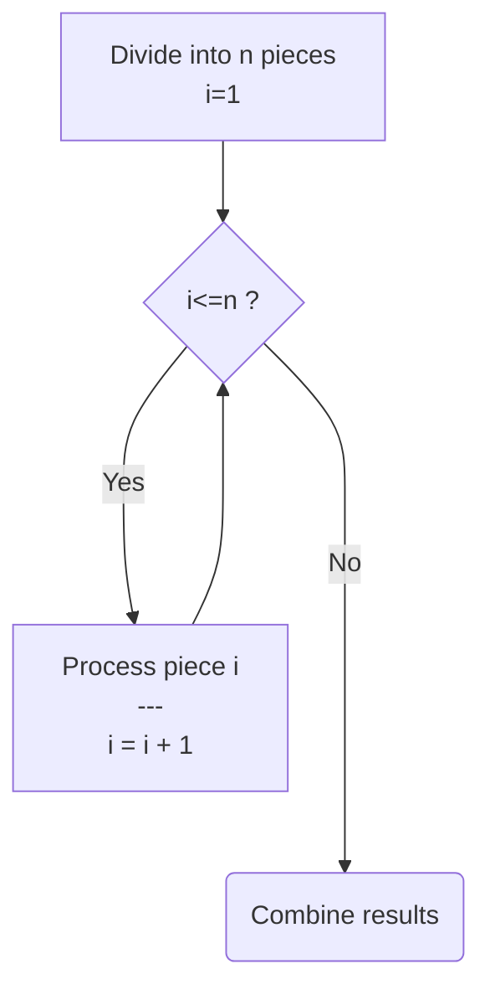
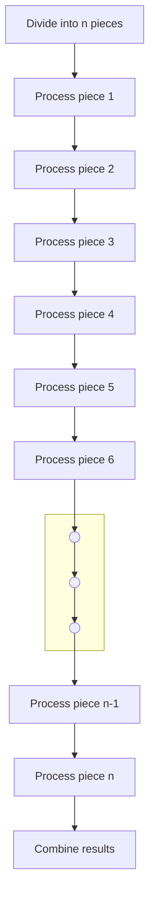
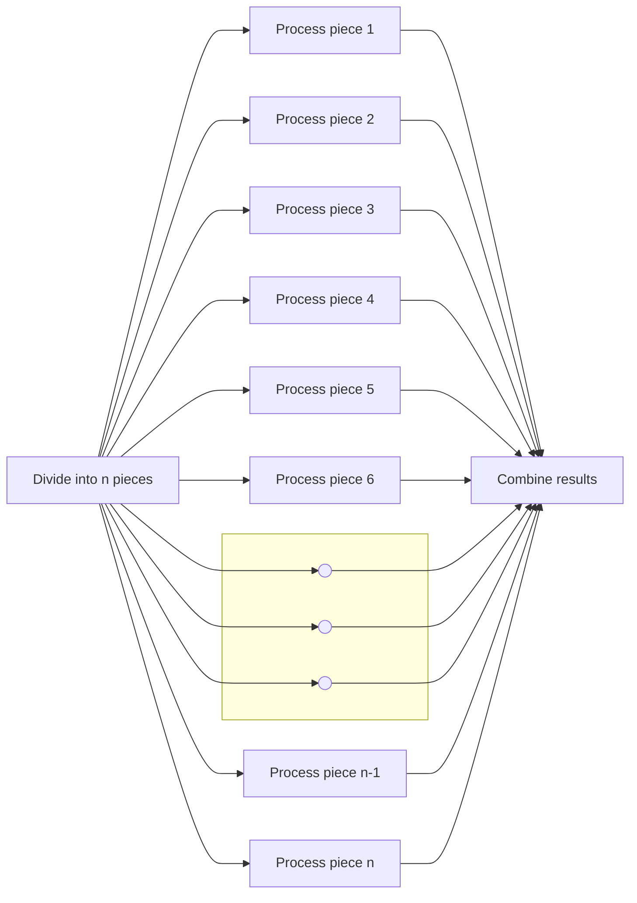
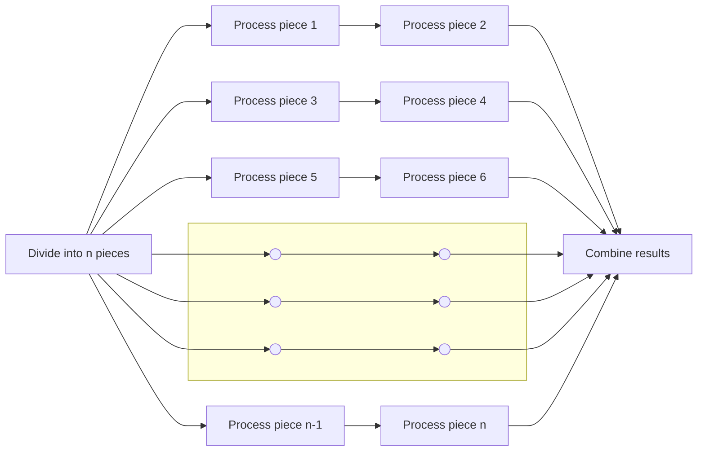

# FEderated process and data DISTribution
A federated approach to process and data distribution

## Abstract
When a problem overwhelms us we [divide and conquer](https://en.wikipedia.org/wiki/Divide-and-conquer_algorithm) its complexities to express the solution as work for a computer. When a computer's workload overwhelms its capacity we employ a simmilar set of tools to spread the load across multiple processes running [concurrently](https://en.wikipedia.org/wiki/Parallel_computing) on multi-core hardware and/or [distributed](https://en.wikipedia.org/wiki/Distributed_computing) over several connected computers which the existing facilities in both [Distributed Erlang/OTP](https://www.erlang.org/doc/system/distributed.html) and [Distributed Elixir](https://hexdocs.pm/elixir/distributed-tasks.html) assume to be connected via a fast private (local) network. Connecting nodes or clusters over public networks and/or high latency links renders the built-in facilities ineffective. 

The FeDist library for Elixir implements a specialised form of process- and data-distribution dubbed Federated Distribution which overcomes LAN dependency, increases tolerance for high network latency and outages and provide the means to spread the workload so that inter-node network traffic is minimised.

## Federated Distribution

To describe how Federated Distribution differs from its more complex general purpose relatives a quick review how process and data distribution works is in order to highlight the key differences.

### Abstract Solution
As a starting point, let's assume we've divided and conquered our way through the complexities of a problem to the point where we have a set, array or list of pieces that needs to be processed in a specific way to get the result we need. In a pseudo flow-diagram it might look something like this (Figure 1):

#### Figure 1: Pseudo Algorithm

### Naive Execution (Single Process)
Supposing we implement that pseudo solution as a single process we can expect that the loop in Figure 1 would expand to somthing resembling Figure 2 below:

#### Figure 2: Single Tasking

### Ideal Parallel Execution
Alternatively we can arrange to use a separate process to do the processing for each piece. Provided we have sufficient cores and use well-written processes we can ideally expect the work getting done as depicted as below in Figure 3:

#### Figure 3: Multitasking (Ideal)
### Realistic Parallel Execution
In reality, especially when there's way more pieces than cores or threads, the processing of the pieces ends up being spread more or less evenly across the computers, cores and threads (and even processes when we realise that even Erlang/Elixir have limitations as to how many processes it can run). The result, however we choose to allocate pieces to processes might look something like what's depicted here in Figure 4:

#### Figure 4: Multitasking (Constrained)

## Distribution Delineation
If we say deliniation is the way the pieces are assigned to processors we'd call the piece attribute that determines its allocation its distribution delineator, e.g. the index or position of the piece in an array or list in the examples above would be its delineator.

### Simple Delineation
Building a distributed system is hard enough already so keeping it as easy as possible by making simplifying assumptions and decisions is common practice. This usually results in the computers being clustered all being equally powerful and having access to the same data making delineation a trivial matter resolved by using randomisation or round-robin allocation.

### Advanced Delineation
So far we've silently assumed simple delineation, i.e. that each process or processor gets the same amount of work to do. We've also assumed that from the processes' perspectives which pieces they're assigned to process is immaterial. Those assumptins are relatively safe to make on a single computer and even on a LAN connected cluster. If however our problem already breaks the assumptions of simple delineation before we've started solving it, we'd be forced to consider [smarter](https://en.wikipedia.org/wiki/SMART_criteria) ways to allocate work to processors.

Of the endless possibilities, let's consider these two:

#### Allocation based on capacity
Assuminng our objectives include for all the work to complete as early as possible, but not all the processes run at the same pace (and/or not all the pieces require the same amount of work) we'd need to allocate pieces to processes based on the speed of the process(or) and the size of the jobs we give it. 

#### Allocation based on privilege
Assuming our objecives include minimising resource usage, but processing a piece on a specific (set of)processor(s) uses significantly less resources compared to others we'd need to allocate pieces to processors where it would use the least resources.

### Delineation in FeDist
Normally we'd expect that more advanced delineation would increase the complexity of a distributed system exponentially. However, when there is some clearly identified dominant delineator already front and center in the problem before we've even writing software to solve it, the inverse is true. To use simple delineation in those scenario complicates matters and isolating the delineator as a separate concern which slots into a support library that allows for process and data distribution based governed by that domain specific delineator actually makes writing such systems a great deal simpler, perhaps even trivial.

## Other Libraries

Why a new library when there's already several in what seems to be the same space ranging from several service mesh implementations such as [Linkerd](https://linkerd.io), [Istio](https://istio.io) and even Elixir-specific adaptations such as [Meshx](https://hexdocs.pm/meshx/readme.html)? Then there's [Partisan](https://github.com/lasp-lang/partisan) and [ProcessHub](https://github.com/alfetahe/process-hub). Someone even suggested that [Riak's Core](https://github.com/basho/riak_core) could help.

The decision to create a new library only came after all attempts to find alignment between the actual problem space and the concepts used in or established by the candidate libraries had revealed the harsh truth that firstly all the libraries tended to increase the overall complexity, secondly no one library solved the entire problem and thirdly using a combination of libraries compounded the additional complexity by making the overlaps in functionality and clashing concepts issues to deal with in the application code. 

## Zyx - Federated Distribution By Example

> "Zyx" is a placeholder name for the actual application that gave rise to and serves as anchor tenant of the FeDist library. Some time after its public launch, the placeholder will be replaced with the actual applications's name. 

Technically Zyx is nothing particularly special. It has some unique features which are separate concerns unaffected by how the data and processing is distributed. Zyx is written in Elixir using the Phoenix Framework with LiveView as critical success factor. 

If the Zyx users were all near enough to a single city or datacenter to provide a good user experience from a cluster of load-balanced nodes in that datacenter it would have been sufficient and simple to arrange. The workload generated by a single user is small enough to facilitate hundreds to thousands of concurrent users on a node. 

The underlying concept in Federated Distribution is to retain as much as possible of that simplicity. If each cluster of nodes ran an independent instance of the application it would be that simple - each having its own set of users with their own data to worry about but that would run contrary to Zyx's objectives. Inspired by its namesakes in administrative and geopolitical system Federated Distribution allows each region to operate independently but provides a structured mechanism to coordinate and exchange data between regions, effectively combining the independent regions under one umbrella. 

It's both impossible and unnecessary to know in advance what proportion of any region's data would only ever be referenced within the region versus the what would be referenced across region boundaries. Impossible because it depends purely on what data users add and how well it is received, but unneccessary because data that is referenced across region boundaries evidently have (more) value to users in other regions so the cost of replicating those records to the regions where they are needed is warranted. What is possible, necessary and important is to make provision for such data to be identified automatically, dynamically replicated as requried without overrunning available resources and of course monitored so that additional resources can be deployed to where it would be most effective.

Also aligned with real-world federation concepts is Federal Distribution's acknowledgement that regions are neither static nor sized equally. Every region grows at its own rate, meaning it's almost certain that no two will be the same size at the same time. As they grow beyond the region's provisioned capacty the users in that region needs additional resources either in the form of more nodes to the cluster or additional clusters. The latter would require that there are datacenters closer to some users in the original region that could host a cluster that's closer to those users. But if access times would be uneffected it would make more sense to grow the number of nodes in the cluster sharing the workload.

### Database IDs

As direct consequence (or enabler, depending on your perspective) of the Federated Distribution approach it emerges as essential that every fragment of "federated" data has something about it that binds it to its home or owner region. Though users are also bound to one region at a time which can change over time there is no room for ambiguity with respect to which region owns which fragment of data. In bona fide distributed databases such as [YugabyteDB](https://www.yugabyte.com) this can lead to incredibly complex configurations especially when it starts involving [remote clusters](https://www.yugabyte.com/blog/tag/xcluster/). FeDist has simplicity as a primary objective and that is best served when the home region of each fragment of data forms part of its key or identifier. For Zyx that means that the 64 bit (bigint) identifier it uses for its main data tables are split into 16 bits for a region id and 48 bits as generated (sequence) identifier unique within the region. Configured like that, any data reference (foreign key) encountered in code can be inspected quickly separated into those available locally and those that needs to come from which other region(s). Which means that the applications's business logic at that point need not distinguish and can deal with all data the same and let the data access layer resolve the local and remote distinction.

This identifier, in particular the 16 bits of region identifier it contains is the reference implementation for Zyx's choice of deliniator. The globe being recursively subdivided into smaller and smaller subregions in accordance with where active users are is not something Zyx cam change so adopting a dynamic hierarchy of regions as delineator into the application as its fundamental delineator for data- and process- distribution allows Zyc to match its distributed facilities very accurately to the reality of its ennvironment.

### Region Hierarchy

In case it wasnt' clear above it bears getting highlighted that 16 bits worth of region number is a lot of regions. We also saw that for the application to respond accurately to where and when user nunbers grow we don't want a flat list of non-overlapping regions but rather one global region that keeps subdividing into smaller regions as required resulting in a hierarchical region structure. This structure is going to become critically important when we tackle inter-region communication because if there's one lesson we learnt well from the built-in distribution facilities it is that a full mesh between all nodes doesn't scale well when thousands of nodes are involved.  

### Speratation of Concerns

Given the importance of region identifiers and region hierarchy in the applciation's design it would not appear out of place for the application to implement what it needs for distributed processing and data storage from first principles using low level libraries.

At the other end of the scale the application's designers might choose a powerful high level library which comes with its own approach to process- and data-distribution that the application design has to confirm with if. 

The more beneficial middle ground is to isolate delineation as a separate concern which the application supplies in the form of a defined interface which the library then calls to accurately inform the decisions it makes regarding data- and process-distribution.

