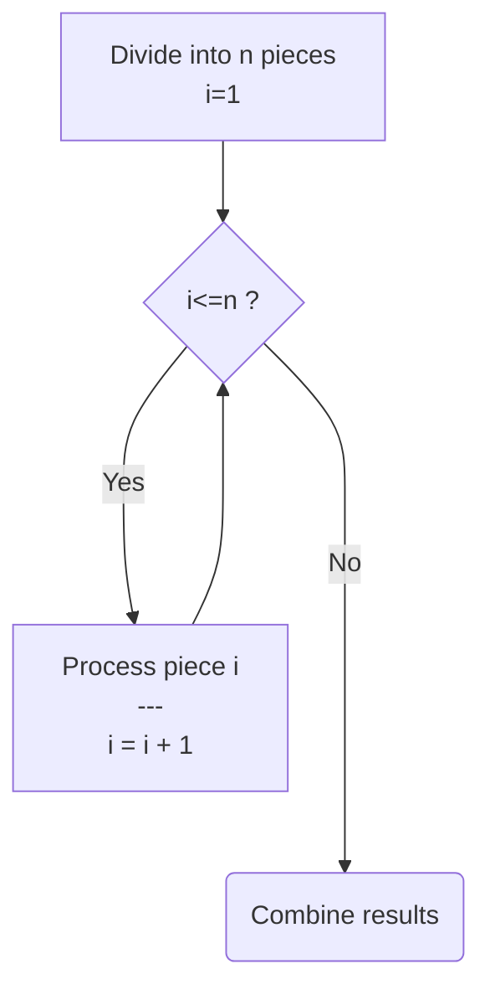
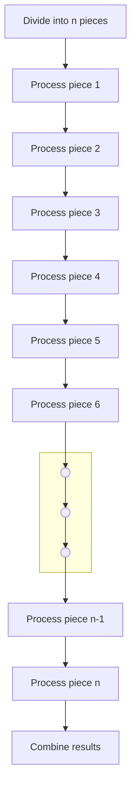
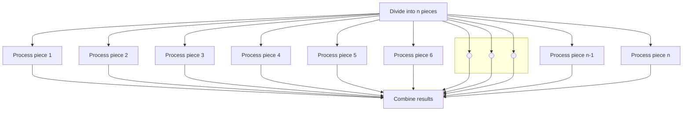
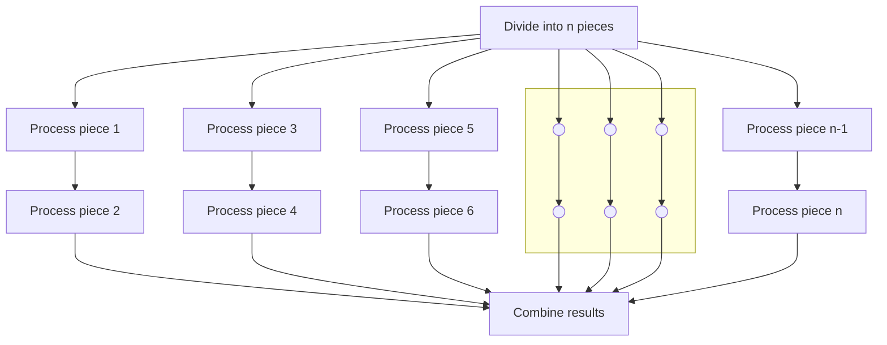

# FEderated process and data DISTribution
A federated approach to process and data distribution

## Abstract
When a problem overwhelms us we [divide and conquer](https://en.wikipedia.org/wiki/Divide-and-conquer_algorithm) its complexities to express the solution as work for a computer. When a computer's workload overwhelms its capacity we employ a simmilar set of tools to spread the load across over multiple processes running [concurrently](https://en.wikipedia.org/wiki/Parallel_computing) on multi-core hardware and/or [distributed](https://en.wikipedia.org/wiki/Distributed_computing) several connected computers which the existing faciliteis in both [Distributed Erlang/OTP](https://www.erlang.org/doc/system/distributed.html) and [Distributed Elixir](https://hexdocs.pm/elixir/distributed-tasks.html) assume to be via a fast private (local) network but break down whenever nodes need to connect over public networks and/or high latency links. 

The FeDist library for Elixir implements a specialised form of process- and data-distribution called Federated Distribution which overcomes LAN dependency, increases tolerance for high network latency and outages and provide the means to spread the workload so that inter-node network traffic is minimised.

## Federated Distribution

To describe how Federated Distribution differs from its more complex general purpose relatives, we need to review how process and data distribution works in order to highlight the key differences.

### Abstract Solution
As a starting point, let's assume we've divided and conquered our way through the complexities of a problem to the point where we have a set, array or list of pieces that needs to be processed in a specific way to get the result we need. In a pseudo flow-diagram it might look something like this (Figure 1):

#### Figure 1: Pseudo Algorithm

### Naive Execution (Single Process)
Supposing we implement that pseudo solution as a single process we can expect that the loop in Figure 1 would expand to somthing resembling Figure 2 below:

#### Figure 2: Single Tasking

### Ideal Parallel Execution
Alternatively we can arrange to use a separate process to do the processing for each piece. Provided we have sufficient cores and use well-written processes we can ideally expect the work getting done as depicted as below in Figure 3:

#### Figure 3: Multitasking (Ideal)
### Realistic Parallel Execution
In reality, especially when there's way more pieces than cores or threads, the processing of the pieces ends up being spread more or less evenly across the computers, cores and threads (and even processes when we realise that even Erlang/Elixir have limitations as to how many processes it can run). The result, however we choose to allocate pieces to processes might look something like what's depicted here in Figure 4:

#### Figure 4: Multitasking (Constrained)

## Distribution Delineation
If we say deliniation is the way the pieces are assigned to processors we'd call the piece attribute that determines its allocation its distribution delineator, e.g. the index or position of the piece in an array or list in the examples above would be its delineator.

### Simple Delineation
Building a distributed system is hard enough already so keeping it as easy as possible by making simplifying assumptions and decisions is common practice. This usually results in the computers being clustered all being equally powerful and having access to the same data making delineation a trivial matter resolved by using randomisation or round-robin allocation.

### Advanced Delineation
So far we've silently assumed simple delineation, i.e. that each process or processor gets the same amount of work to do. We've also assumed that from the processes' perspectives which pieces they're assigned to process is immaterial. Those assumptins are relatively safe to make on a single computer and even on a LAN connected cluster. If however our problem already breaks the assumptions of simple delineation before we've started solving it, we'd be forced to consider [smarter](https://en.wikipedia.org/wiki/SMART_criteria) ways to allocate work to processors.

Of the endless possibilities, let's consider these two:

#### Allocation based on capacity
Assuminng our objectives include for all the work to complete as early as possible, but not all the processes run at the same pace (and/or not all the pieces require the same amount of work) we'd need to allocate pieces to processes based on the speed of the process(or) and the size of the jobs we give it. 

#### Allocation based on privilege
Assuming our objecives include minimising resource usage, but processing a piece on a specific (set of)processor(s) uses significantly less resources compared to others we'd need to allocate pieces to processors where it would use the least resources.

### Delineation in FeDist
Normally we'd expect that more advanced delineation would increase the complexity of a distributed system exponentially. However, when there is some clearly identified dominant delineator already front and center in the problem before we've even writing software to solve it, the inverse is true. To use simple delineation in those scenario complicates matters and isolating the delineator as a separate concern which slots into a support library that allows for process and data distribution based governed by that domain specific delineator actually makes writing such systems a great deal simpler, perhaps even trivial.

